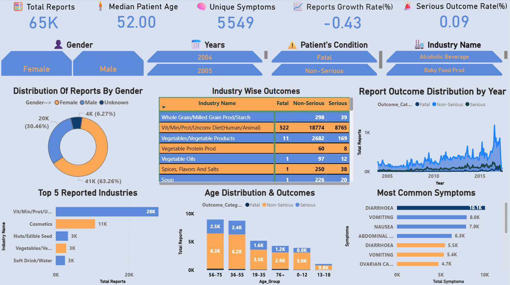

<h1 align="center">📊 FDA Adverse Event Analysis (CAERS)</h1>

  <b>Power BI Dashboard | Public Health & Product Safety Analytics</b>

<h2>🎯 Project Objective</h2>

The <b>CFSAN Adverse Event Reporting System (CAERS)</b> is a critical surveillance
database maintained by the FDA that captures adverse event and product complaint
reports related to <b>foods, dietary supplements, and cosmetics</b>.

This project analyzes CAERS data spanning <b>2004 to Q2 2017</b> to uncover
meaningful insights into <b>product safety and public health risks</b>.
The primary goal is to identify patterns and trends across
<b>product categories, demographics, symptoms, and outcomes</b>
using standardized <b>MedDRA-coded terminology</b>, supporting
regulatory monitoring and evidence-based decision-making.

<h2>📊 Dataset Overview</h2>

The dataset consists of FDA-submitted adverse event reports, where each record
represents a single reported case containing detailed information about the
product, patient, and adverse event.

<ul>
  <li><b>RA_Report #</b> – Unique identifier for each adverse event report</li>
  <li><b>RA_CAERS Created Date</b> – Date the report was entered into CAERS</li>
  <li><b>AEC_Event Start Date</b> – Date the adverse event began</li>
  <li><b>PRI_Product Role</b> – Suspect or concomitant product</li>
  <li><b>PRI_Reported Brand/Product Name</b> – Product associated with the event</li>
  <li><b>PRI_FDA Industry Code & Name</b> – FDA product classification</li>
  <li><b>CI_Age at Adverse Event</b> – Patient age</li>
  <li><b>CI_Age Unit</b> – Age unit (years, months, etc.)</li>
  <li><b>CI_Gender</b> – Patient gender</li>
  <li><b>AEC_One Row Outcomes</b> – Hospitalization, ER visit, non-serious, fatal</li>
  <li><b>SYM_One Row Coded Symptoms</b> – MedDRA-coded symptoms</li>
</ul>

<h2>🛠️ Data Preparation & Modeling</h2>
<ul>
  <li>Cleaned and standardized raw data using <b>Power BI Power Query</b></li>
  <li>Created derived columns such as <b>Age in Years</b>, <b>Event Start Date</b>, and <b>Report Created Date</b></li>
  <li>Implemented a <b>star schema data model</b> for efficient relationships</li>
  <li>Developed <b>DAX measures</b> for event counts, demographics, and outcome analysis</li>
</ul>

<h2>🔍 Key Insights from the Dashboard</h2>

<ul>
  <li><b>High Reporting Volume:</b> ~65K adverse event reports highlight substantial consumer safety concerns.</li>

  <li><b>Demographic Risk Patterns:</b>
    <ul>
      <li>Females account for ~63% (41K) of reports</li>
      <li>Median patient age is <b>52 years</b>, with the <b>36–75 age group</b> most affected</li>
    </ul>
  </li>

  <li><b>Industry-Level Concentration:</b>
    <ul>
      <li>Vitamins, minerals, proteins & supplements dominate (~28K reports)</li>
      <li>Cosmetics and certain food categories still show serious outcomes</li>
    </ul>
  </li>

  <li><b>Outcome Severity:</b> Serious and fatal outcomes persist across multiple industries, not isolated cases.</li>

  <li><b>Symptom Patterns:</b>
    <ul>
      <li>5,549 unique symptoms reported</li>
      <li>Most common: Diarrhea, vomiting, nausea, abdominal pain</li>
    </ul>
  </li>

  <li><b>Trend Over Time:</b> Reporting increases steadily, with visible spikes after 2013.</li>

  <li><b>Risk Indicators:</b>
    <ul>
      <li>Overall growth rate: <b>-0.43%</b></li>
      <li>Serious outcome rate: <b>~0.9%</b>, indicating ongoing high-impact risks</li>
    </ul>
  </li>
</ul>

<h2>📈 Dashboard Preview</h2>

  

<h2>💼 Business & Public Health Impact</h2>
<ul>
  <li>Supports FDA-style <b>regulatory safety surveillance</b></li>
  <li>Identifies <b>high-risk products, demographics, and symptoms</b></li>
  <li>Enables <b>data-driven decision-making</b> in public health</li>
  <li>Demonstrates strong <b>Power BI, DAX, and data modeling skills</b></li>
</ul>

  <i>📌 This project demonstrates how analytics can transform raw regulatory data into actionable public health insights.</i>

